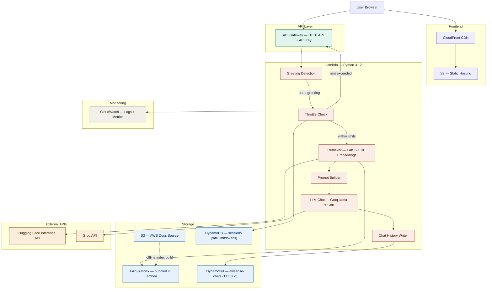

# AWSense

A full-stack RAG chatbot that answers questions about AWS services and architecture, grounded in official AWS documentation.

**[Live Demo →](https://d3nw1hzdw4124c.cloudfront.net/)**

   
---
[](https://github.com/Shagnikpaul/awsense/actions/workflows/ci.yml)
 [](https://github.com/Shagnikpaul/awsense/actions/workflows/deploy.yml)


---

## Overview

AWSense takes a natural language question about AWS, retrieves relevant chunks from a FAISS vector index built from official AWS documentation, and generates a cited answer using an LLM. Built as a 1-month project alongside AWS Solutions Architect Associate (SAA-C03) study.


---
## Screenshots
#### Default Starting Page


#### Chat Window


#### Topic Selection Menu

---


## Architecture Diagram




**Architecture Notes**

- The frontend is a static React build served through CloudFront, with S3 as the origin, caching assets at the edge for fast global delivery.
- Every request to the backend passes through API Gateway, which enforces API key authentication before reaching Lambda — protecting `/chat` and `/conversations` from unauthenticated traffic.
- A lightweight greeting detector runs first inside Lambda, short-circuiting trivial inputs like "hi" before any embedding, retrieval, or LLM call — keeping token usage and latency near zero for non-substantive messages.
- Real AWS questions pass through a throttle check backed by a DynamoDB `sessions` table, which tracks per-session request counts and token usage and rejects requests exceeding configured limits with HTTP 429 — before any external API calls are made.
- Retrieval is fully local: a FAISS index built offline from 30+ AWS documentation pages is bundled directly inside the Lambda package. The only external call in this step is to Hugging Face's Inference API, which converts the user's query into an embedding vector. No managed vector database is involved.
- Retrieved context and the user query are assembled into a structured prompt and sent to Groq's API running `openai/gpt-oss-20b` for response generation — chosen specifically because it has no AWS service dependency, sidestepping the Bedrock throttling issues hit early in the project.
- Every conversation turn (user message and assistant response) is written to a separate DynamoDB table (`awsense-chats`) for persistent chat history. Since sessions are anonymous UUIDs stored in browser localStorage, this table uses a 30-day TTL so orphaned sessions are cleaned up automatically with no manual intervention or ongoing cost.
- All Lambda invocations emit structured JSON logs and custom metrics to CloudWatch, giving visibility into invocation counts, error rates, latency percentiles, and token usage without a separate logging service.


---

## Tech Stack

| Layer | Technology |
|---|---|
| Frontend | React 18, Vite, Tailwind CSS, shadcn/ui |
| Hosting | AWS S3 + CloudFront |
| API | AWS API Gateway + Lambda (Python 3.12) |
| LLM Inference | Groq API — `llama-3.1-8b-instant` |
| Query Embedding | Hugging Face Inference API — `all-MiniLM-L6-v2` |
| Vector Store | FAISS (`faiss-cpu`) — index built offline, bundled in Lambda |
| IaC | AWS CDK (Python) |
| CI/CD | GitHub Actions |
| Monitoring | Amazon CloudWatch |
| Secrets | AWS SSM Parameter Store |

---

## Features

- Semantic retrieval over 30+ AWS documentation pages
- Topic filter for AWS services
- Source citations from official AWS documentation
- Token usage per response
- Request rate limiting (20 requests/client/hour)
- Persistent conversations stored in DynamoDB
- Conversation sidebar with previous chats
- Conversation history restoration across browser refreshes

---

## Project Structure

```text
awsense/
├── frontend/                     # React + Vite application
│   ├── public/
│   └── src/
│       ├── api/                  # Backend API client
│       ├── components/           # Chat UI components
│       ├── hooks/                # Custom React hooks
│       ├── pages/
│       ├── utils/
│       └── main.jsx
│
├── backend/
│   ├── src/
│   │   ├── handler.py            # Lambda entry point
│   │   ├── llm_chat.py           # OpenAI GPT-OSS inference
│   │   ├── retriever.py          # FAISS retrieval + HF embeddings
│   │   ├── prompt_builder.py
│   │   ├── response_formatter.py
│   │   ├── validator.py
│   │   ├── query_classifier.py
│   │   ├── throttle.py           # Rate limiting
│   │   ├── chat_history.py       # Persistent conversations
│   │   ├── metrics.py            # CloudWatch custom metrics
│   │   └── logger.py
│   │
│   ├── tests/
│   │   ├── unit/
│   │   └── integration/
│   │
│   ├── vector_store/
│   │   ├── awsense.index
│   │   └── documents.pkl
│   │
│   └── python_packages/          # Vendored Lambda dependencies
│
├── infra/                        # AWS CDK infrastructure
│
├── scripts/
│   ├── ingest_docs.py
│   ├── build_vector_store.py
│   └── clean_documents.py
│
├── docs/                         # AWS documentation source files
│
├── k6/                           # Performance/load tests
│
├── reports/                      # Coverage & SLA reports
│
└── .github/
    └── workflows/
        ├── ci.yml
        └── deploy.yml
```

---

## Local Setup

### Prerequisites
- Node.js 18+
- Python 3.12+
- AWS CLI configured
- AWS CDK CLI: `npm install -g aws-cdk`

### Backend

```bash
cd backend
python -m venv .venv && source .venv/bin/activate
pip install -r requirements.txt
```

Build the FAISS index (run once after cloning):

```bash
cd scripts
python build_vector_store.py
# Outputs: vector_store/awsense.index + vector_store/documents.pkl
```

Run tests:

```bash
pytest --cov=src --cov-report=html
```

### Frontend

```bash
cd frontend
npm install
npm run dev
# http://localhost:5173
```

### Infrastructure

```bash
cd infra
pip install -r requirements.txt
cdk synth
cdk deploy
```


---

## API Reference
## API Reference

### `POST /chat`

```json
// Request
{
  "message": "How does S3 versioning work?",
  "clientId": "client-123",
  "conversationId": "conversation-456",
  "topicFilter": "S3"
}
```

```json
// Response
{
  "answer": "S3 versioning lets you preserve, retrieve, and restore every version of an object stored in a bucket.",
  "sources": [
    "https://docs.aws.amazon.com/AmazonS3/latest/userguide/Versioning.html"
  ],
  "token_usage": {
    "inputTokens": 312,
    "outputTokens": 128
  }
}
```

---

### `GET /conversations`

Returns all conversations belonging to a client.

**Headers**

```
x-api-key: <API_KEY>
x-client-id: client-123
```

```json
[
  {
    "conversationId": "conversation-456",
    "clientId": "client-123",
    "title": "How does S3 versioning work?",
    "createdAt": "2026-06-30T10:15:42Z",
    "updatedAt": "2026-06-30T10:20:18Z"
  }
]
```

---

### `GET /conversations/{conversationId}`

Returns all messages in a conversation.

**Headers**

```
x-api-key: <API_KEY>
x-client-id: client-123
```

```json
[
  {
    "role": "user",
    "content": "What is Amazon S3?",
    "sources": [],
    "tokenUsage": {},
    "timestamp": "2026-06-30T10:15:42Z"
  },
  {
    "role": "assistant",
    "content": "Amazon S3 is an object storage service...",
    "sources": [
      "https://docs.aws.amazon.com/AmazonS3/latest/userguide/Welcome.html"
    ],
    "tokenUsage": {
      "inputTokens": 797,
      "outputTokens": 247
    },
    "timestamp": "2026-06-30T10:15:44Z"
  }
]
```

---

### `GET /health`

```json
{
  "status": "healthy",
  "service": "AWSense"
}
```

---

### Error Responses

Requests exceeding **20 requests per client per hour** return **HTTP 429** with a `Retry-After` header.

Common error responses:

```json
{
  "error": "Unauthorized"
}
```

```json
{
  "error": "Conversation not found"
}
```

```json
{
  "error": "Rate limit exceeded",
  "code": "RATE_LIMITED",
  "requestId": "..."
}
```

The API never returns raw stack traces to clients.


## Testing

### Backend
- Unit Tests (pytest)
- Integration Tests (pytest)

### Frontend
- Component & API Tests (Vitest)

### Performance
- k6 load testing

Coverage includes:

- Retriever
- Prompt Builder
- Handler
- Chat History
- Validator
- Query Classifier
- Response Formatter
- Persistent Conversation APIs


---

## CI/CD Pipeline

GitHub Actions automates the complete deployment workflow:

1. Build React frontend using Vite
2. Download and clean AWS documentation pages
3. Generate FAISS vector store automatically
4. Run backend integration tests
5. Package Lambda dependencies into `python_packages`
6. Deploy infrastructure using AWS CDK
7. Upload frontend to S3 + CloudFront

The vector store is generated dynamically during CI/CD and bundled into the Lambda deployment package automatically.

### Environment Variables

No secrets are committed to this repository. Production secrets are managed through GitHub Actions secrets and Lambda environment variables.

| Variable | Description |
|----------|-------------|
| `OPENAI_API_KEY` | API key for OpenAI-compatible LLM inference (`openai/gpt-oss-20b`) |
| `HF_TOKEN` | Hugging Face token for embedding generation (`all-MiniLM-L6-v2`) |
| `API_KEY` | API authentication key for backend endpoints |
| `CONVERSATIONS_TABLE` | DynamoDB table storing conversation metadata |
| `CHAT_MESSAGES_TABLE` | DynamoDB table storing chat messages |
| `VITE_API_BASE_URL` | API Gateway base URL used by the frontend |
| `VITE_API_KEY` | API key used by the frontend |
| `AWS_REGION` | AWS deployment region |
| `CDK_DEFAULT_ACCOUNT` | AWS account ID used by CDK |
| `CDK_DEFAULT_REGION` | AWS region used by CDK |


---

## Known Limitations

- Bedrock inference not yet active — pending quota resolution from AWS support
- Using Groq API now with low token and requests limit so frequent 429 errors are expected.


---

## Cost Summary

| Service | Week 1 | Week 2 | Week 3 | Week 4 | Total |
|---|---|---|---|---|---|
| Amazon S3 | Free tier | Free tier | Free tier | Free tier | $0.00 |
| CloudFront | — | Free tier | Free tier | Free tier | $0.00 |
| API Gateway | Free tier | Free tier | Free tier | Free tier | $0.00 |
| AWS Lambda | Free tier | Free tier | Free tier | Free tier | $0.00 |
| DynamoDB | — | — | Free tier | Free tier | $0.00 |
| CloudWatch | Free tier | Free tier | Free tier | Free tier | $0.00 |
| Groq API (LLM inference) | — | — | Free tier | Free tier | $0.00 |
| Hugging Face Inference API (embeddings) | — | — | Free tier | Free tier | $0.00 |
| **Total** | | | | | **$0.00** |

> **Note:** AWSense was originally designed around Amazon Bedrock (Claude Haiku for inference, Titan Embeddings + OpenSearch Serverless for retrieval). Persistent throttling on Bedrock in Week 1 led to a pivot toward Groq's LLM API and Hugging Face's Inference API, both of which remained entirely within free-tier limits for the duration of the project. All AWS-native services used (S3, CloudFront, API Gateway, Lambda, DynamoDB, CloudWatch) also stayed within AWS Free Tier throughout. Total infrastructure cost for the project: **$0.00**.

## Architecture Decisions

**Why not Amazon Bedrock?**
The original design used Bedrock Knowledge Base (OpenSearch Serverless + Titan Embeddings) for retrieval and Claude Haiku for inference. Persistent `429` throttling errors across all Bedrock models and regions in Week 1 made this path unreliable. An AWS support case is open. The current stack (Groq + HF Inference API + FAISS) runs at effectively zero variable cost and unblocked development. The retrieval layer is isolated so Bedrock can be reintegrated by changing one file.


**Why FAISS inside Lambda?**

Keeps the entire retrieval pipeline within one compute unit — no external vector DB to manage or pay for. The index is built offline and loaded into `/tmp` on Lambda cold start. Tradeoff: slightly higher cold-start latency (~2s). Provisioned concurrency will be evaluated in Week 3 if needed.

---


## License

MIT
