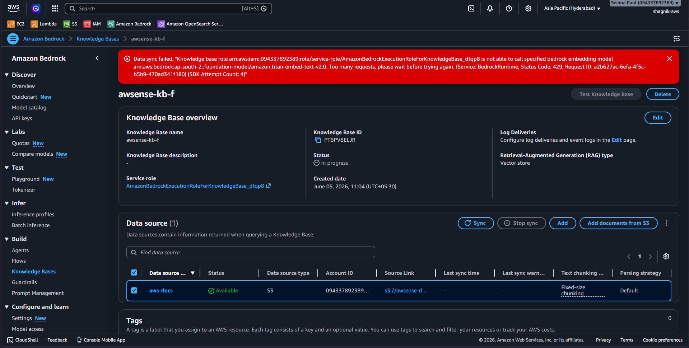

You can send this concise report:

# AWS Bedrock Knowledge Base Sync Issue

## Setup

* Created an S3 bucket containing AWS documentation files
* Created an Amazon Bedrock Knowledge Base connected to the S3 bucket
* Using:

  * Titan Text Embeddings v2
  * OpenSearch Serverless vector store

---

# Problem

When syncing the data source, the sync always fails with this exact error:




```text
Data sync failed. "Knowledge base role arn:aws:iam::094337892389:role/service-role/AmazonBedrockExecutionRoleForKnowledgeBase_dtqp8 is not able to call specified bedrock embedding model arn:aws:bedrock:ap-south-2::foundation-model/amazon.titan-embed-text-v2:0: Too many requests, please wait before trying again. (Service: BedrockRuntime, Status Code: 429, Request ID: a2b627ac-6efa-4f5c-b5b9-470ad341f180) (SDK Attempt Count: 4)"
```

---

# Troubleshooting Already Tried

* waited for cooldown/reset period
* reduced HTML docs into simplified TXT paragraph files
* reduced file count from 30 files to only 2 files
* checked IAM role permissions
* tested other AWS regions including US regions
* direct Bedrock model invocation also resulted in throttling behavior

All attempts gave similar results.

---

# Current Understanding

The issue does not appear to be:

* S3 configuration
* OpenSearch configuration
* IAM permissions
* document size/count

Possible issue:

* Bedrock runtime throttling
* hidden account-level quota restriction
* embedding model access issue

---

# Current Alternative Plan

Alternative approach is to:

* build embeddings/vector retrieval locally
* use local vector database + local RAG pipeline
* send retrieved context to Bedrock model only for final response generation
